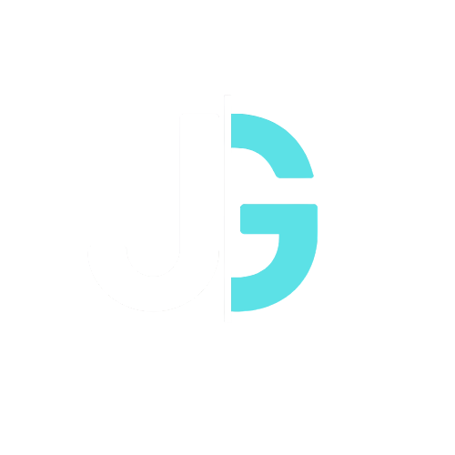

<!-- Banner -->

  

<!-- Typing SVG with blue text and blinking cursor -->

  

<!-- Social icons section -->

  
  
  
  
  

<!-- About Me -->
<h2 class="glitch-type">⊱ 👨‍💻 About Me ⊰</h2>

  I'm a driven college student studying <strong>Computer Science and Cybersecurity</strong>, currently seeking <strong>Spring and Summer 2026 internships</strong> to grow my experience and impact in the field.

  Through building a personal cybersecurity lab, <strong>developing scoring engines</strong> for competitions, and competing in <strong>NCAE Cyber Games</strong>, I’ve developed strong technical, communication, and leadership skills.

  I'm especially passionate about roles in <strong>Cybersecurity Engineering</strong>, <strong>Threat Hunting</strong>, and <strong>Infrastructure Security</strong>, but I’m open to opportunities across <strong>Cybersecurity</strong>, <strong>IT</strong>, or <strong>DevSecOps</strong> nationwide.

<!-- Projects -->
<h2 class="glitch-type">⊱ 🛠️ Personal Projects ⊰</h2>
<!-- Portfolio Website -->

  <!-- ATLANTIS Scoreboard -->

<!-- Skills -->
<h2 class="glitch-type">⊱ 💻 Technical Skills ⊰</h2>

<!-- Programming Languages -->
<h3>👨‍💻 Programming and Markup Languages</h3>

  
  
  
  
  
  
  
  
  

<!-- Frameworks and Libraries -->
<h3>🧰 Frameworks and Libraries</h3>

  
  
  
  

<!-- Databases and Cloud -->
<h3>🗄️ Databases and Cloud Hosting</h3>

  
  
  
  

<!-- Tools -->
<h3>💻 Software and Tools</h3>

  
  
  
  
  
  

<!-- Certs -->
<h2 class="glitch-type">⊱ 🎓 Certifications ⊰</h2>
<ul>
  <li>
    <a href="https://www.comptia.org/certifications/security" target="_blank">
      
      In Progress
    </a>
  </li>
  <li>
    <a href="https://tryhackme.com/p/jdgeisler" target="_blank">
      
      Ongoing
    </a>
  </li>
</ul>

<!-- GitHub Stats -->
<h2 class="glitch-type">⊱ 📊 GitHub Stats ⊰</h2>

  
  

 

  <picture>
    <source media="(prefers-color-scheme: dark)" srcset="https://github.com/Sklffy/Sklffy/blob/output/github-contribution-grid-snake-dark.svg" />
    <source media="(prefers-color-scheme: light)" srcset="https://github.com/Sklffy/Sklffy/blob/output/github-contribution-grid-snake.svg" />
    
  </picture>

<!-- Connect -->
<h2 class="glitch-type">⊱ 🔗 Connect with Me ⊰</h2>

  
  
  
  

<!--Glitched-->

